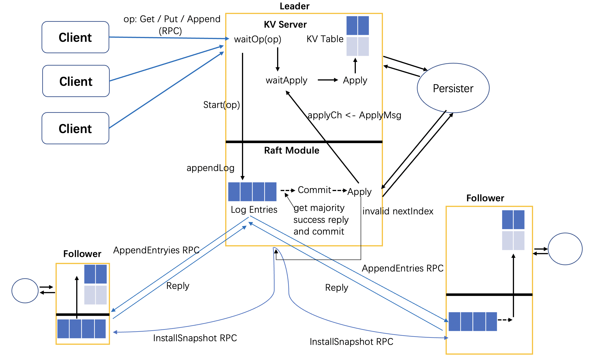

# GetaKV


## Introduction

**GetaKV** is a **Shard Key/Value System** using **Raft** to support distributed fault-tolerance.
It is based on the labs of **[MIT-6.824](http://nil.csail.mit.edu/6.824/2020/schedule.html)**.

- **Lab1: MapReduce** ✅
- **Lab2: Raft** ✅
  - Lab2A: Leader Election ✅
    - Lab2B: Log Replication ✅
    - Lab2C: Persistent States ✅
- **Lab3: Raft KV** ✅

  - Lab3A: KV on Raft ✅
  - Lab3B: Log Compaction / Snapshot ✅
- **Lab4: Shard KV** ⏳

  - Lab4A: Shard Master ✅
  - Lab4B: Sharded KV Server ⏳
- **Improvement**
    - Add simple parser and persistent file to save.
    - More clear structure.

Current progress: Lab3 finished. Single node KV Raft available. Not sharded yet.

## K/V System Architecture:



(Vote mechanism and some other details are not included)

## Raft Implementation:


## Build & Run

- Test

  If you want to test, you can(test for raft is similar):

  ```shell
  cd src/kvraft # or `cd raft`
  go test
  ```

  If you want to run particular test:

  ```shell
  cd src/kvraft
  go test -run 3B
  ```

  If you want to run test in batch, you can run the script:

  ```shell
  cd src/kvraft
  ./test_batch.sh
  ```

  You may need to modify the srcipt file to do your own batch-test.
- Run single node KV Raft

  ```shell
  cd src/main
  go run kvsingle.go
  ```

## Test and Execution Result


