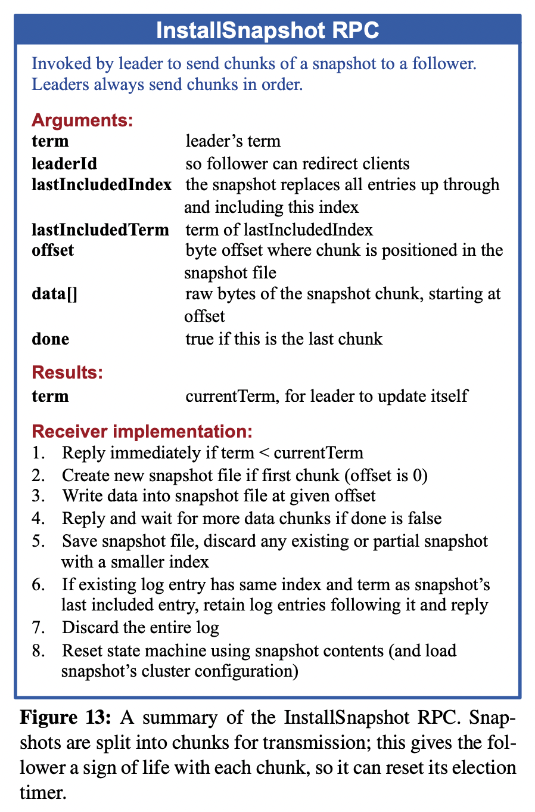

**GetaKV** is a **Shard Key/Value System** using **Raft** to support distributed fault-tolerance.
It is based on the labs of **MIT-6.824**.

- **Lab1: MapReduce** ✅

- **Lab2: Raft** ✅
  
    - Lab2A: Leader Election ✅
    - Lab2B: Log Replication ✅
    - Lab2C: Persistent States ✅
    
- **Lab3: Raft KV** ⏳
  
    - Lab3A: KV on Raft
    - Lab3B: Log Compaction / Snapshot
    
- **Lab4: Shard KV**
  
    - Lab4A: Shard Master
    - Lab4B: Sharded KV Server
    
- **Improvement**

  

Current progress: Lab2B finished.

Raft Implementation:

